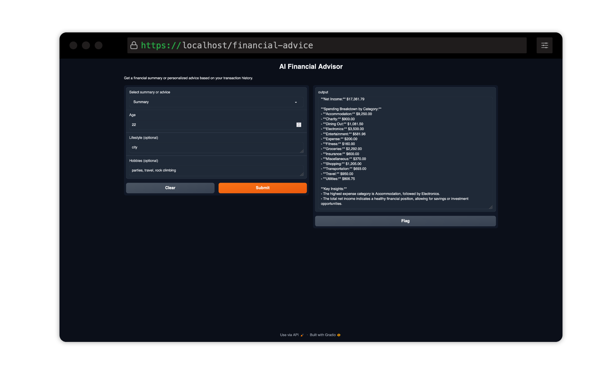

# AI Financial Advisor

This project by [Vincent Koc](https://github.com/vincentkoc) and [Hung Nguyen](https://github.com/hung-ngm) demonstrates how to build a personalized AI Financial Advisor using Python, OpenAI's GPT model, and Google Sheets or local CSV data. It's designed for people who want to learn some basics of AI, particularly those with existing Python knowledge or beginners in the field.

This is a great project for learning about AI, finance, and Python. This project can easily be adapted to other datasets and LLMs as well as other financial advice use cases from financial planning to investment advice to retirement planning and even startups.

## Features

- Data extraction from Google Sheets or local CSV
- Transaction categorization using OpenAI's GPT model
- Generation of financial summaries and personalized advice
- PDF report generation
- Interactive Gradio UI for easy interaction with the advisor
- Jupyter notebooks for step-by-step analysis and UI creation

## Prerequisites

- Python 3.7+
- OpenAI API key
- Google Cloud Platform account with Google Sheets API enabled (if using Google Sheets)
- Required Python libraries (installed via pip)

## Setup

First Option (Jupyter Notebook):
1. Use the notebook notebook/01_financial-analysis-notebook.ipynb to setup your project and generate the data.
2. Use the notebook notebook/02_gradio-gpt.ipynb to test the advisor interface.

Second Option (Python Script):
1. Clone this repository
2. Install required dependencies: `pip install -r requirements.txt`
3. Copy `example.env` to `.env` and update the values:
   ```
   cp example.env .env
   ```
4. Update the following variables in your `.env` file:
   - `OPENAI_API_KEY`: Your OpenAI API key
   - `GOOGLE_APPLICATION_CREDENTIALS`: Path to your Google Cloud credentials JSON file (if using Google Sheets)
   - `USE_GOOGLE_SHEETS`: Set to `true` if using Google Sheets, `false` if using local CSV
   - `DUMMY_DATA_SPREADSHEET`: URL of the dummy data Google Sheet (provided in the example.env)

## Project Structure

- `notebook/`: Jupyter notebooks for analysis and UI creation
  - `01_financial-analysis-notebook.ipynb`: Step-by-step financial analysis
  - `02_gradio-gpt.ipynb`: Gradio UI integration with GPT
- `scripts/`: Python scripts for various functionalities
  - `data_extraction.py`: Functions to load data from CSV or Google Sheets
  - `financial_advice.py`: Generate personalized financial advice
  - `financial_summary.py`: Generate financial summaries
  - `gradio_ui.py`: Gradio UI setup and launch
  - `main.py`: Main script to run the application
  - `report_generation.py`: Generate PDF reports
  - `transaction_categorization.py`: Categorize transactions using GPT
- `data/`: Directory for storing local CSV data
  - `data.csv`: Example data

## Data

The data is a CSV file with the following columns:
- `Date`: The date of the transaction
- `Description`: The description of the transaction
- `Amount`: The amount of the transaction
- `Category`: The category of the transaction

This synthetic data was generated using OpenAI's GPT-o1 Preview model.

## Usage

### Running the Main Application (Python Script)

Run the main script:

```
python main.py
```

This will start the Gradio UI, allowing you to interact with the AI Financial Advisor.

## License

This project is open-source and available under the GPLv3 License.
